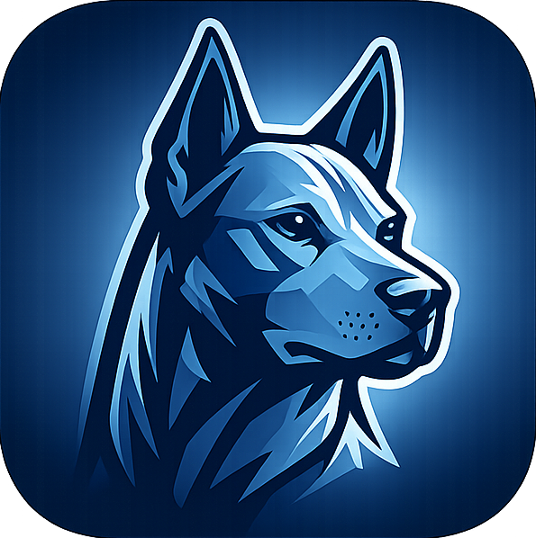

# Ridgeback

An experimental terminal emulator written in Rust, exploring ways to add more functionality to the terminal experience.


---



## Overview

Ridgeback is a terminal wrapper that integrates GPU shader effects, AI-assisted command suggestions, split pane tab groups, and a Lua plugin system. 
It runs on Windows, macOS, and Linux.


## Features

- **Tab groups & split panes** — split the window into groups, each with their own tabs and terminals (like an IDE)
- **GPU shader effects** — CRT scanlines, fire backgrounds, and other visual effects via wgpu
- **AI integration** — ghost-text autocomplete and natural-language command lookup (LM Studio, OpenAI, Claude)
- **Editable input line** — local input buffer with cursor, selection, undo/redo
- **Lua plugins** — extend with scripts for shader effects, particles, and session export
- **Find in session** — search scrollback with regex support
- **Configurable** — TOML config with profiles, keybindings, rendering, and AI settings

---

## Getting Started

### Requirements

- Rust 1.75+ ([rustup](https://rustup.rs/))
- Windows 10 1903+, macOS 12+, or Linux
- A GPU with Vulkan, DX12, or Metal support (for shader effects)

### Build & Run

```bash
git clone https://github.com/your-username/ridgeback.git
cd ridgeback
cargo run --release
```

### Configuration

On first launch a default config is created at:

| Platform | Path |
|---|---|
| Windows | `%APPDATA%\Ridgeback\config.toml` |
| macOS | `~/Library/Application Support/Ridgeback/config.toml` |
| Linux | `~/.config/ridgeback/config.toml` |

Or open settings from within the app with **Ctrl+,**.

---

## Keyboard Shortcuts

| Shortcut | Action |
|---|---|
| `Ctrl+T` | New tab in focused group |
| `Ctrl+W` | Close current tab |
| `Ctrl+Tab` | Next tab (within group) |
| `Ctrl+Shift+Tab` | Previous tab (within group) |
| `Ctrl+Shift+D` | Split right (new group) |
| `Ctrl+Shift+E` | Split down (new group) |
| `Ctrl+Shift+W` | Close group |
| `Ctrl+Alt+Right` | Focus next group |
| `Ctrl+Alt+Left` | Focus previous group |
| `Ctrl+Alt+Shift+Right` | Move tab to next group |
| `Ctrl+Alt+Shift+Left` | Move tab to previous group |
| `Ctrl+S` | Save session to file |
| `Ctrl+F` | Find in session |
| `Ctrl+/` | AI command query |
| `Ctrl+,` | Open settings |
| `Ctrl+Shift+P` | Reload plugins |

All shortcuts are re-bindable in `config.toml`.

---

## Docs

- [Profile & Settings Reference](docs/profile-settings.md)
- [Shader Effects](docs/shaders.md)
- [Plugin System](docs/plugins.md)
- [Casting & Screen Sharing](docs/casting.md)
- [Architecture & Tech Stack](docs/architecture.md)

---

## Contributing

Contributions are welcome! Please open an issue first to discuss larger changes.

1. Fork the repository
2. Create a feature branch
3. Make your changes and ensure `cargo clippy` and `cargo test` pass
4. Submit a pull request

---

## License

MIT — see [LICENSE](LICENSE) for details.

Copyright (c) 2026 Josh van den Heever
